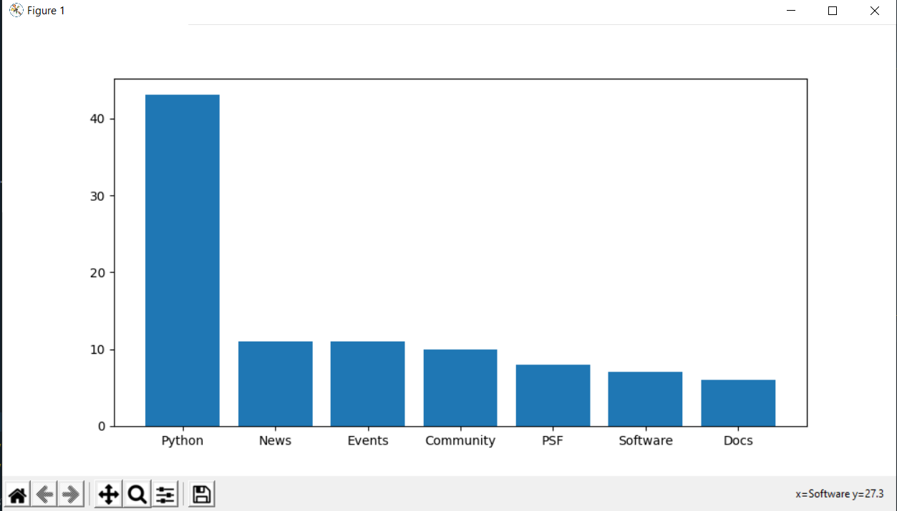
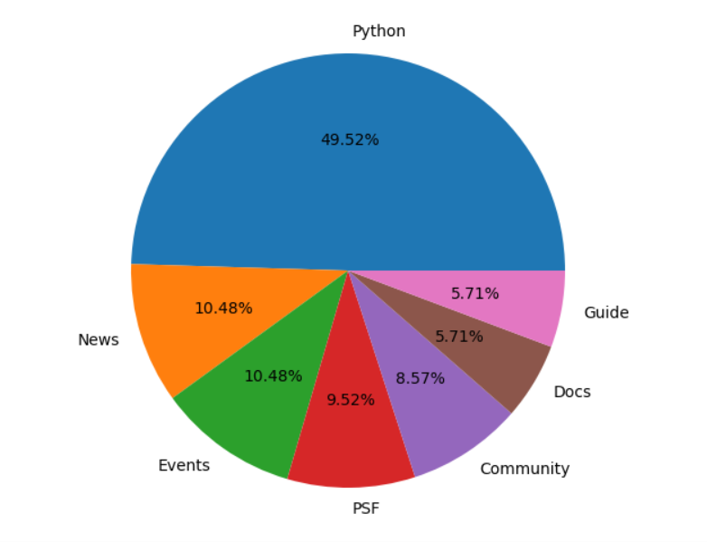

# Web Scrapping, Data Analysis and Data Visualization

In this task, you will encounter and use the following;

- Requests module
- Beautiful Soup library
- Matplotlib library
- csv module
- Test-Driven Development

## Conventions / Coding Styles

1. Notice that names of modules, methods, functions and variables are `snake_cased`, while names of classes are `PascalCased`
2. Ensure to have two spaces exactly between import and actual codes in modules
3. Ensure to be consistent with the usage of string quotes. Always use the single quote except in situations where you need to use double quotes

## Github Convention

1. Create a branch named `implement-web-analysis` and only work within this branch
2. Complete implementation and testing of the web analysis
3. When done, push your changes and raise a pull request on Github using the pull request template already added to the project (`.github` folder)

## Approach

- Ensure to understand the problem before attempting to write any code
- Ensure to write the expected unit tests first before actual implementation, as that confirms that you are conforming to the `TDD Methodology`.
- Ensure to manually experiment within the modules to confirm the results of your implementations

## Running Your Tests

```bash
Machine>> cd <this-project-folder>

Machine>> python -m unittest tests
```

## Website Analysis

This week's project will include the requests module, Beautiful Soup, csv module and matplotlib libraries.

The goal for this project is to create a command-line application that will accept a website url and scrape it html contents.

From the contents scraped, you are to filter out the most used words and display it.

The data should be display in a nicely formatted pie and/or bar plot, making it easier to understand and to make meaningful business decision from it.

Also the application should log all website url it scrapped into a `log.csv` file.

## Task Analysis and Design

We need to lay out a design of what the final program should look
like, as well as how it should function. For testing purposes, we’ll use Python’s home
page. Eventually, we’ll want the final output to look like...



and/or



## Step by step Analysis

- We’re going to make the program continually ask the users if they’d like to scrape a web site
- Accept the users’ input for the site they’d like to analyze.
- After that, we can filter out all information that isn’t useful like
  - All non-text elements, such as scripts, comments, etc.
  - All common article words and useless characters like newlines characters, empty spaces and tabs
    - *check utils module in for list of common words and feel free to add to*
- Finally, create the bar plot. The program output should look like the following:

```bash

>>> Would you like to scrape a website (y/n)? y
>>> Enter a website to analyze: https://www.python.org
>>> The top word is: python
>>> *** show bar plot ***
>>> Would you like to scrape a website (y/n)? n
>>> Thanks for analyzing! Come back again!

```


**NOTE:** **Your implementation for this mini project should deploy the usage OOP (Object Oriented Programming Paradigm) and confirm with SOLID Principle.**
